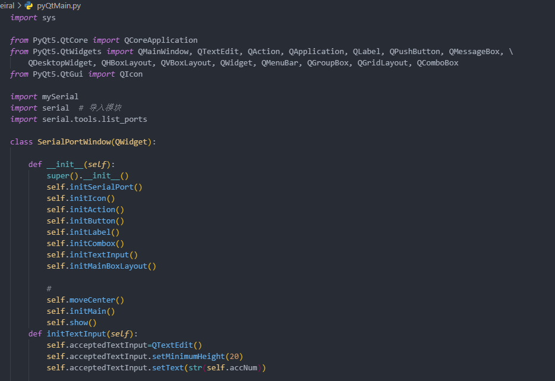
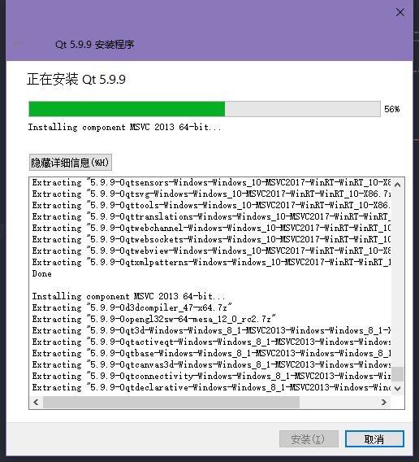

# pyserial实现py上位机
[](https://github.com/RichardLitt/standard-readme)

支持兴爷,说到上位机,就是应用层面了,我就感兴趣了,刚好python也容易写这种东西

正在学习,估计这几天能做出来

## Warning



### 立刻马上停止直接用pyqt5写！！

**不要像我一样直接用python api 去写，你会崩溃的，幸好qt带了qt转pyqt的功能。**

*我们只需要写对应的功能即可*

### SO
*现在立刻马上去用QT!!*



[具体可见](https://blog.csdn.net/qq_23237491/article/details/90711138)


## Table of Contents

- [Update](#Update)
- [Requirement](#Requirement)
- [Background](#background)
- [Install](#install)
- [Usage](#usage)
- [Example](#Example)
- [API](#api)
- [Contributing](#contributing)
- [License](#license)

## Update

- 2020年11月3日23:10:59 更新readme

## Requirement

- pyqt5 latest version
- pyserial

## Background

### FUCK UP

## Install

- PyQt5

```
pip3 install -i http://mirrors.aliyun.com/pypi/simple/ PyQt5 PyQt5-tools --trusted-host mirrors.aliyun.com
```

- QT

    [https://mirrors.tuna.tsinghua.edu.cn/qt/archive/qt/5.9/5.9.9/qt-opensource-windows-x86-5.9.9.exe](https://mirrors.tuna.tsinghua.edu.cn/qt/archive/qt/5.9/5.9.9/qt-opensource-windows-x86-5.9.9.exe)

## Usage

```
git clone https://github.com/ZHKU-Robot/pySerialPort.git
```

## Example

```python
import mySerial
myPort=mySerial.Port("com9",115200,1)
print(myPort.checkPorts())
myPort.writeData("wdnmd\r\n")
myPort.getWholeData()
```

```python
Serial<id=0x1e196103888, open=True>(port='com9', baudrate=115200, bytesize=8, parity='N', stopbits=1, timeout=1, xonxoff=False, rtscts=False, dsrdtr=False)
your serial port had been opened 
 whose info will be showed next ..
your device named com9
port type is com9
your baud is 115200
bytesize is 8
parity is N
stopbits is 1
timeout is 1
writeTimeout is None
xonxoff is False
rtscts is  False
dsrdtr is False
interCharTimeout None
your serial port is com9
['COM9']
writed 7 bytes!
current input buffer size is 27
whole data is

wdnmd


serial port closed

Process finished with exit code 0

```


## API

### Still Developing

## More optional sections

- Developing..

## Contributing


## License

[MIT © Richard McRichface.](../LICENSE)